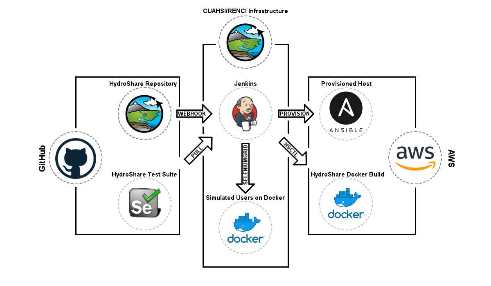

# Setup Jenkins server for automated systems testing with CI/CD pipeline

### Core concept of the QA automation server


### Spin up simulated users
Install Docker and Docker Compose on the server, then navigate to the [docker/continuous-integration/](https://github.com/CUAHSI/QA-AutomationEngine/blob/develop/docker/continuous-integration/) directory and run the following command.  This will create a network interface for the Jenkins container and the SeleniumGrid containers to share.  If the SeleniumGrid is ran on a different host, the network setup step here does not provide any value, but it shouldn't cause problems.
```
docker network create cuahsi_ci
```
Next, create simulated user Docker containers, using the following command.  The resulting SeleniumGrid system can be used for the testing of any product - the users don't have logins, special configurations, or any other relationship to a specific product.  It's also worth noting that these simulated user containers persist through test suite runs.  However, the system automatically clears cache, cookies, etc. between test executions.
```
bash simulate-users.sh
```
### Spin up Jenkins automation server
Navigate to the [docker/continuous-integration/](https://github.com/CUAHSI/QA-AutomationEngine/blob/develop/docker/continuous-integration/) folder and run:
```
docker-compose up -d
```
### Get the Jenkins instance password and finish Jenkins installation through the GUI on port 8080.
* ``` docker exec -it [JENKINS DOCKER CONTAINER NAME] cat /var/jenkins_home/secrets/initialAdminPassword ``` to get the instance password
* Open the Jenkins GUI to finish the installation (e.g. localhost:8080 in a browser), login with the admin password, and install suggested plugins
* Use "Continue as admin" instead of creating a user
### Setup the "command core" and "hydroshare-job-template" jobs
```
docker exec -t [JENKINS DOCKER CONTAINER NAME] bash /var/jenkins_home/cuahsi/jenkins/setup.sh
```